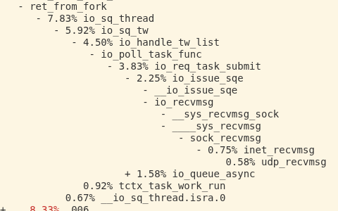
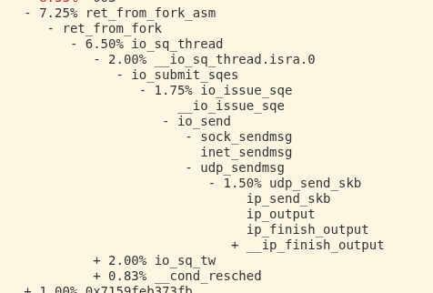
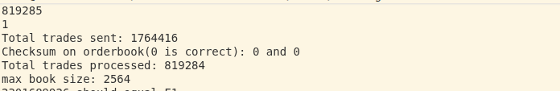
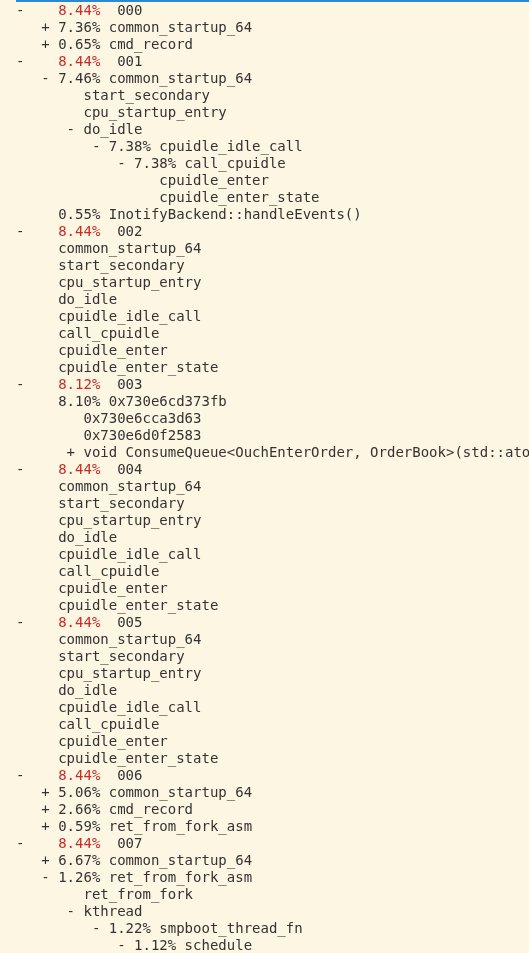
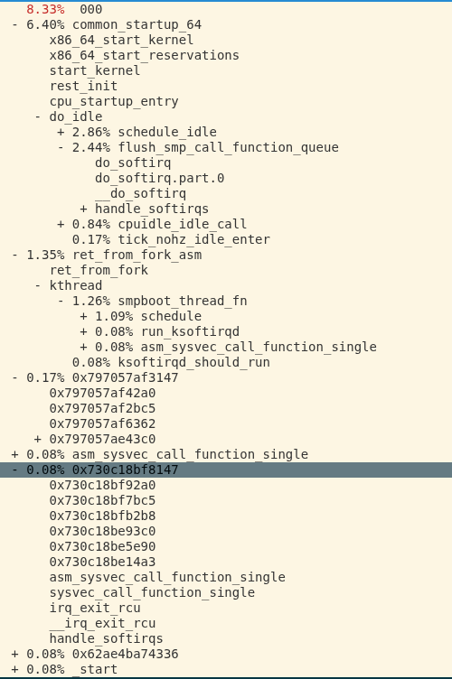
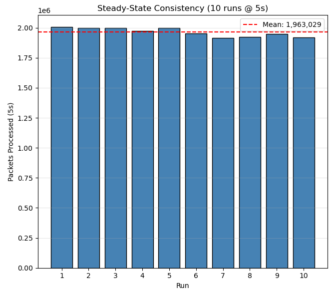
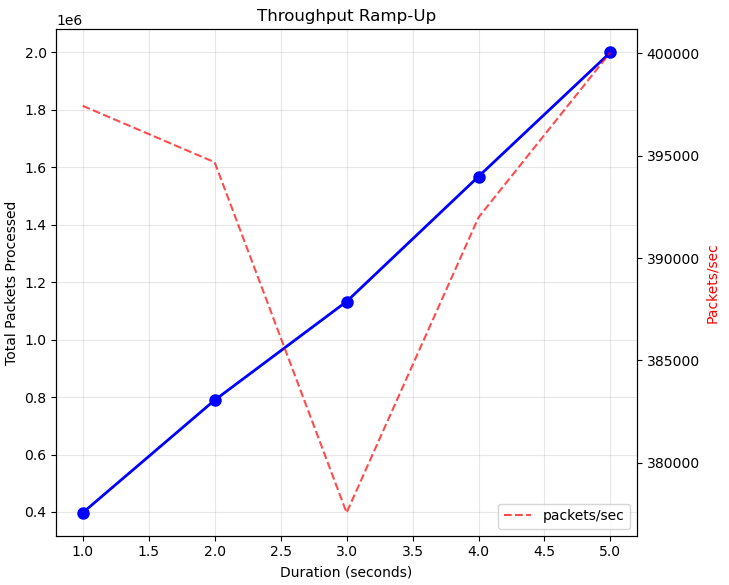

# OUCH Matching-Engine

## Project Overview
This project works to implement a price-time exchange running on the NASDAQ OUCH format. To give myself a different route for exploration than many have before in projects like these, I am choosing to implement an anti-low-latency exchange based on similar logic to IEX which will execute all trades in a price-time manner at intervals of 100ms (i.e. every 100ms all pending trades timestamped before that set time are executed). This setup causes the exchange engineering question to be much more about throughput than about latency concerns (since we can timestamp packets and execute asynchronously). Because of that design choice, this project is mostly an experiment on using profiling tools and understanding the internals of Linux to optimize throughput. I wrote down my entire path to get where I ended up in this readme as a sort of engineering journal, and I hope this read gifts you some mechanical sympathy as it did me :)

## Caveats:

Real exchanges generally use TCP connections and obviously send ACKs, provide latency figures, and do price calculation via a fair price calculation on the aggressor (we have no distinction there so default to bid price, which creates very different incentives like likely eliminating sell-side edge in practice due to a race-to-the-bottom on priority). A real exchange structured in this way would likely have a hard time staying liquid with a tight spread.

## Setup, Configurations, and Machine-Aware Variables

Since this repo must be bound to machine cores properly to work, setup is a bit more involved than running make. First, you need to find what cores are pinnable logically and physically. I would recommend isolating logical cores whose hyperthreaded twins are isolated for best performance. By running 

`lscpu -e`

You can see all of your machine's logical processors and what physical cores they correspond to. This script is set up to use three pinned isolated cores and one non-isolated core. To configure, put a comma separated list of the indices of logical cores you want to pin to and isolate on the first line. Put your non-pinned, non-isolated core on the second line. On the third line, put a list of all of the logical processors that you want RPS (soft IRQ balancer) to send IRQs to. This list should probably be all of the logical processors that are not pinned to the same physical core as your pinned, isolated cores. The fourth line should be a list of the logical processors that you want isolated. This list should most likely be all of the logical processors which are being used by the first line (pinned for this application) or the hyperthreading pairs of those cores.

Once this step is done, you can run

`sudo sh ./setup.sh`

to configure your kernel with these settings. After this is done, you can reboot to have these changes take place. Once your kernel is configured, you can make this project and run it!

This is as simple as 

`sudo setupNamespaces.sh`

`make -B ./build`

`make --build ./build`

`sudo run.sh`

After which you will get a readout from the simulated exchange for the results of the run. Additional configurations like port and IO batchsizes can be set within run.sh in the arg order of port, bufferSize(for the SPSC ring buffer), and sendSize(for the exchange batched sendmmsg calls).

## 1. A First Attempt: SPSC + Batched IO Syscalls

The Producer and Consumer both run bound to separate cores. Because both the Producer and Consumer use batched syscalls, we have both a tail and head pointer for the ring buffer which makes batched read/writes easy. Producer gets UDP messages using recvmmsg(). We use std::atomic with release memory orderings for the tail and head pointer updates, however, for reading the tail in the Consumer thread, we don't use the traditional acquire pairing. Because the tail monotonically increases, getting an outdated value is not an issue, and since the buffer write is "happens before" the tail index update, we can use a relaxed memory order to allow for the speculative execution of the consumer on the buffer. On Intel machines, however, they compile into the same instructions.

I optimized the SPSC as much as I could by profiling with perf and got to >99% of the time in the producer spent on recvmmsg() and <10% of the consumer time within the actual orderbook consumption function.

Because we are bound on recvmmsg, I perf-ed it with a dwarf call stack and got:

It looks like about 30% of this recvmmsg is in the context switching and syscall overhead, about 30% is in waiting for the next packet, and the remaining 30% is internal to the Linux UDP network stack. What is really surprising to me about this is that online, it's easy to hear about the millions of packets/sec that io_uring provides over syscalls, however, here we see really only a potential doubling improvement over using the normal blocked syscall because the context switching overhead is about equal to the amount of time it takes to process a UDP packet and give it to userspace on my machine. I'll ensure that the simulator is faster and once that bottleneck is cleared, it will be interesting to see if io_uring makes the actual UDP packet processing and handoff from the socket into userspace more efficient rather than just eliminating the syscall overhead. At the end of the day, however, the processing it needs to do which takes ~30% seems like it may be similar. I'll read more and we will see!

As for the lack of packets coming in, I was surprised since when I ran an analysis of sent/received packets to see if that was the bottleneck, I got this chart:

What we see here is that as we increase the time of the simulation, the total packets obviously rise linearly, but the amount of packets received divided by the amount sent, the receive rate, is not near 1 and not constant! We would expect a near-1 rate if our SPSC was actually bound on the number of orders coming in, however, this is not what we see. One possible explanation is that the SPSC has a higher startup overhead and the simulator sends a bunch of packets before it can start receiving, artificially lowering the receive rate, however, if we increase the time, we would expect the receive rate to then converge to one, and instead it stays constant. We see an 80% accept rate across all time horizons, which points to loss on the socket queue acceptance end(i.e tons of deliveries at once, overloading the queue leading to packet rejection).

My first idea of fixing this is to ensure our recvmmsg thread never gets slept by the scheduler if it times out, which will hopefully cause it to poll the whole time and not let bursts come in without taking messages from the socket at a higher rate.

Wow... I ran lscpu and realized I only have 4 physical cores... setting the affinity correctly and disabling IRQs on the three I use for SPSC and the simulator, I literally doubled the output to 200k/s. Insane! It looks like all along the huge bottleneck was literally the producer just being slept and then packets getting rejected by the kernel for a full socket queue! With a receive rate of about 1, we know that the actual bottleneck here is now in the simulator rather than the producer. Let's perf the simulator!

Okay, the context switching overhead is actually only 1/39 of the used CPU time. It looks like 7/39 is on nf hooks, which is a clear candidate to get rid of. That is far from a major breakthrough though or the context-switch bound situation that people online talk about needing io_uring for. Looking further, 14/38 of the time is actually spent... receiving?

So, we receive with 14%/39% of our sender thread, which 7% of that 14% is nf_hooks again, meaning that we spend 14/39 on nf_hooks and we do 7% of the sender thread on actually putting our message within the socket for the recv thread. Of that 7%, we are actually spending half on a spinlock on the socket.

So, the obvious next step here to optimize our sender is turning off our network hooks(looks like our local deliver(NF_INET_LOCAL_IN) and outward send hooks(NF_INET_LOCAL_OUT) are triggering) and then maybe getting the receive of the packet onto a different thread(ideally the system's core 0 rather than the producer/recv thread). Let's do that!

Well, also here we have to make a decision about how we want to think about this simulation. Because we are just sending packets between two applications, we could use eBPF to directly link them, however, I think that is contrary to what I want to learn in optimizing this stack, instead, I would rather pretend(or actually set up) a network interface that passes these packets so there is room to optimize down there later as well. Because of that, I'm going to use veth(recommended by Claude as a way to simulate this). This will do the pass over the data-link layer. All this entailed was creating two network namespaces and binding veth interfaces to each other within the namespaces as described in [this](https://superuser.com/questions/764986/howto-setup-a-veth-virtual-network). Because we have a virtual network interface(only bound between two veth interfaces inside two network namespaces) we load them individually in the sender and receiving threads, bind our sockets, and then we can use SO_BINDTODEVICE which will bypass our network hooks!

As you can see, our overhead from our network filtering hooks is gone now that we are on our private network namespaces! After this change, we get boosted to 360k/s with >99% packet reception rate on our producer. Despite this victory, we still see that 14%/35% of our sender is actually still doing the direct local_ip delivery and doing the ip_recv function itself within the softIRQs. Really, we would like the IRQs to get picked up by our allocated system cores rather than the ones we have running our sender. Our IRQs are presumably being triggered by our transmission queue since we see that queue_xmit function. Because this is not actually one process part of our send, we can set our IRQ affinity to 0 for that core to prevent this(and also all the other non-sys cores while we are at it).

Well, looking into irqbalance people seem to think there is a good reason not to shift soft IRQs anywhere on Linux message boards so here I decided not to go down that path yet.

Trying out non-blocking calls for our simulator somewhat unsurprisingly changes neither the output nor even the perf graph. Because the sendmmsg stack is immediately putting a softIRQ onto this core and everything is tied to this core, the waking and sleeping overhead is actually the same since the nonblocking call still sleeps the sender until the message is written due to the softIRQ being scheduled ahead of it.

Interestingly enough, however, at this point we seem to be bound on our consumer! Our producer is actually never waiting for messages and is instead busy waiting for about 1/3 of its time on the consumer!! Below we have a perf to show this:

Because of this, I figure it is about time to optimize the orderbook logic itself. 

(I forgot to screenshot this one at the time but still wrote about it then)

Huh.. weird: 1/3 of the time of the consumer is waiting on the producer and 2/3 of the time of the producer is waiting on the consumer. What this likely means is our consumer has some really heavy peaks which halt the consumer and then lap around quickly, making the producer wait on the consumer 1/3 of the time(it should be 0% ideally). Roughly 20% of the consumer's time is spent in the consume function.

To prevent spiking, I re-structured the actual trade execution. Instead of storing all trades in an array of prices with a DLL of orders in each, I just am making a heap for buy and sell which allows for quick comparisons at the top of each, making execution O(log n * k) where n is the size of the order book and k is the number of trades executed. This compares to the previous algorithm which was O(l) on l being the range of the spread of the orderbook, which could be up to 4096 operations of checking if std::list objects are empty. An important thing to also note is that our orderbook never gets all that large since our generation function is uniformly distributed around the spread.

The redesign is this: keep all the orders in memory in a token -> order hashmap. Then, we only need insert operations and pop to run our buy/sell heaps. We can just tombstone all of the cancel/replace operations within the hashmap in O(1). The great thing about this is we also get contiguous accesses on the std::vector backing our heaps on small objects that fit in the cache(just a token + pointer duo). This setup puts in work and got us down to less than 5% of the consumer time! If we assume relatively evenly distributed compute across consumes, we could 20x our numbers with this current consumer! Below is a snapshot of the post-optimization perf:

Huh... I think I misinterpreted our last perf. I assumed that since only half of the producer was spent in recvmmsg, it must be waiting on the consumer, however, now with the consumer only spending 2% of its time actually consuming and the rest of the time waiting, I realize that if the recvmmsg call immediately returns with only a couple messages often, it will look like we are spinning on the consumer because we are continually loading the atomic for how much we can add to the ring buffer. In reality, our bottleneck could actually be because of recvmmsg not getting much at a time. So, let's look at the simulator:

Well, it is just doing the send syscall the entire time. Looks like our bottleneck is wholly just this sendmmsg. We've already stopped the nethooks and this is just doing the direct to the xmit transmission queue and back.

At this point, I should note that I am switching over to a different reference machine with 8 physical cores which will allow pinning differently. With the machine switch we get to 370k/s. That machine is running an 8840HS Ryzen 7 processor with 16GB of RAM on Linux Kernel 7.0.

## 2. The Right Tool: a free lunch io_uring is not

At this point, I thought that optimizing the syscall which was about 100% of our runtime on the cores(producer and sender) I was measuring might incorporate io_uring due to its ability to reduce context switching overhead, however, this did not end up panning out. After some experimentation here(which resulted in code for a UringExchange executable which was marginally slower than the Syscall one in another branch), I found io_uring to likely NOT be the solution to this problem. Instead, it introduced more overhead through dealing with the queue entries(since even multishot requires a whole lot of that) and an extra bound core to poll the SQEs which could simply be dealing with softIRQs. Our main constraint in recvmmsg is not really the context switch since so much of the overhead is amortized if the buffers were to be full. In failing to make io_uring work I discovered the actual issue was softIRQ balancing. In these perfs though, you can see that io_uring basically burns a core to get rid of the context switching which I found to be not worth it:

Anyway, the io_uring profiling was somewhat spread throughout this process, ended in nothing, and doesn't neatly fit into the story so I will get back to our younger John who is finding out about softIRQ balancing on recvmmsg.

## 3. Past Naivety: laptops are LOUD

So, since io_uring really did not work in terms of throughput and overhead(I'm sure it might be better on latency, but I am not building for latency here due to that being a bit trite/played out), the question then is how I can use the rest of the cores on my machine to handle softIRQs in a way that makes sense(currently being handled by one CPU which is the same one that delivers the UDP packets to the xmit_queue makes absolutely zero sense because basically everything is on that one core).

https://docs.kernel.org/networking/scaling.html gives us a way to balance the recv UDP softIRQs triggered by the hardIRQ from sending a packet to a veth to the non-pinned cores. This allows us to use all of our physical cores to do the network stack work. To do this, I just pinned our SPSC and simulator cores to separate physical cores:

We pin the sender, consumer, and producer cores to 5, 6, and 7 respectively.
The rest of the cores we set for RPS: cores 0,1,2,3,4 which is 0 through logical core 9 using:

`sudo ip netns exec receiver_ns sh -c 'echo 3ff > /sys/class/net/veth-rx/queues/rx-0/rps_cpus'`

and 

`GRUB_CMDLINE_LINUX_DEFAULT="isolcpus=10-15 rcu_nocbs=10-15 nohz_full=10-15 irqaffinity=0-9"`

in /etc/default/grub gets us to ~480k/s on the SPSC and about 530k/s on the sender!! That is a massive improvement, and shows that we now are bound on the SPSC presumably :)

Now, let's see where the bottleneck is.

Huh... the high-precision clock is our bottleneck? A google shows a potential reason: https://news.ycombinator.com/item?id=28661455. Well, actually this makes sense since I am on a laptop and obviously TSC could be a problem due to battery being inconsistent, sleeping, etc.

Because of this, I am actually going to start running benchmarks on a rented bare-metal from Vultr, a dedicated E-2286G (6 cores, 32GB RAM).

Switching over, isolating our three cores for our busy-waits and balancing softIRQs on the other three, we get 730k/s messages. That is an improvement(to be expected) so let's look at what the bottleneck is at this point:

and for our producer(consumer shows entire time basically busy-waiting):

Well, it seems clear what is happening here: only 10% of our producer is actually spent fetching for recvmmsg, it looks like the rest of the time it is basically busy-polling the socket and recvmmsg returns nothing(hence how the top syscall has a lot more percentage than the lower, it is just returning because the socket is empty seemingly). Similarly, we see a 2% spend on the function calculating the number of messages we can take in(which is only a couple instructions and no loads that wouldn't be cached presumably) so that really only can happen if we are polling a LOT and the rest of that ends up in the top of the recvmmsg syscall seemingly. Looking at the sender, we seemingly have maxed-out how many UDP packets we can actually send from one core. It is spending nearly 100% of the time in the core within the actual network stack! And all the recvmmsg softIRQs are offloaded too on this!

So, let's bump it up? Why not grab another sender core to simulate even more messages and just see when the cracks start to show?

Wow, okay, doubling up on our senders gets us to 2 Million/sec, but our producer isn't actually seeing that in its queue? It still looks like it is exiting early the majority of the time. My suspicion is actually that this might be due to the batch sizes on these calls being too large so when the skb is full they deliver partials (or get rejected and take resources) and then we have to wait for the next softIRQ, causing lags on the producer. Sendmmsg actually doesn't error when the skb is full(obviously because sendmmsg puts into the skb).

Wow! Only one message per recvmmsg??? If we tune down our recvmmsg to 4 per call, we see a huge increase since it is timing out less of the time, getting 1 Million/sec. The question here though is how we have literally double the sent rate but are bound on the fullness of the skb? We can see from a counter/calls accumulator that our exchangeSimulator actually is sending all of its 64 batch size per call successfully to its xmit, so... where do they go? We also can see that changing the simulator batch size does not impact the per call count. Let's increase the size of our receive queue? It could be that we are having bursts that maybe saturate due to something like heat throttling? We don't have hypervisor interrupts so that can't be it.

Let's change our buf size? sudo sysctl -w net.core.rmem_max=16777216
No change! Well, are our packets all getting dumped due to softIRQs not getting delivered in time maybe? Let's perf the whole system instead of just our process cores!

Hmm, looks like they are basically idling, and they have an even share of on-CPU as the actual running ones? Maybe SMT actually does take some performance away from us even if we are isolating the cores by re-assigning IRQs on the logical cores tied to physical cores with our processes running? Let's disable SMT and see how this changes. One of the big surprises for me as well is that there is no mention of the recvmmsg IRQs that I thought would be the bottleneck. Because our SMT is not context switching in any other processes though, it might not make sense for this to be actually limiting us in any way... hmm, I do think though, that not having any recvmmsg is suspicious. Because we have 152M events in this, I am going to decrease the percentage limit to zero and decrease the sampling so there is less overhead from that(it caused a bit of a blip on the machine which I am suspicious of).

Okay, looking closer, we actually see that under things like "do_idle" it is actually flushing the function queue, which includes softIRQs and then other headers like ret_from_fork are actually returning from softIRQ functions. When I cut down on each category, every single one is just handling recvmmsg a couple layers down. On this core at least, it does look like the actual work being done is mostly in softIRQs handling recv. So, we are bound on our recvmmsg IRQs... what now? Looking through our OS, every percentage point can be accounted for as working toward this system. It seems like the way to push this system would be to re-enable IRQs on the second simulator core, which gives us a little more recvmmsg capability while bleeding off the excess sendmmsg. With that balancing, the actual received went up marginally, but the sent then becomes the bottleneck with an equilibrium at around 1.02 Million messages a second. It seems that we will really hit the limits of what this system can do without starting to optimize out things within the network stack + syscalls.

At this point, the obvious next step seems to be some sort of kernel bypass because as of now, nearly our entire system is doing I/O handling. I will call this my stopping point to move on to another project, but I will likely re-visit this at some point.

## Note on consistency

I didn't explore this in-depth, but for completeness' sake, here is a profile of messages/sec profiled on another machine which gets ~400k/s:

This is not quite rigorous, but it shows that there isn't some insane startup overhead I am not accounting for in all my measurements, instead, 1s is actually roughly enough time to get an idea of the performance/sec.

## 4. AI Usage

I will not be using any AI-generated code for this project other than where explicitly stated. Currently the only use was generating some of the OUCH generation code which I found tedious.
