# OUCH OrderBook

This project works to implement an orderbook which operates on the NASDAQ OUCH order format which can process as many orders as possible. I am giving myself a time limit of a week to see how far I can push this implementation.

Right now, it is implemented with a SPSC reading from a single UDP port with batched I/O syscalls, and I am working on an io_uring implementation. 

## 1. Single Producer Single Consumer(Batched IO Syscalls)

The Producer and Consumer both run bound to seperate cores. Because both the Producer and Consumer use batched syscalls, we have both a tail and head pointer for the ring buffer which makes batched read/writes easy. Producer gets UDP messages using recvmmgs(). We use std::atomic with release memory orderings for the tail and head pointer updates, however, for reading the tail in the Consumer thread, we don't use the traditional acquire pairing. Because the tail monotonically increases, getting an outdated value is not an issue, and since the buffer write is "happens before" the tail index update, we can use a relaxed memory order to allow for the speculative execution of the consumer on the buffer. On intel machines, however, they compile into the same instructions.

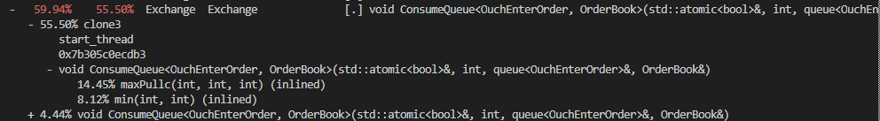

I optimized the SPSC as much as I could by profiling with perf and got to <99% of the time in the producer spent on recvmmsg() and <<10% of the consumer time within the actual orderbook consumption function.

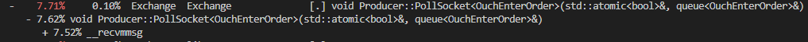

Because we are bound on recvmmsg, I perf-ed it with a dwarf call stack and get:

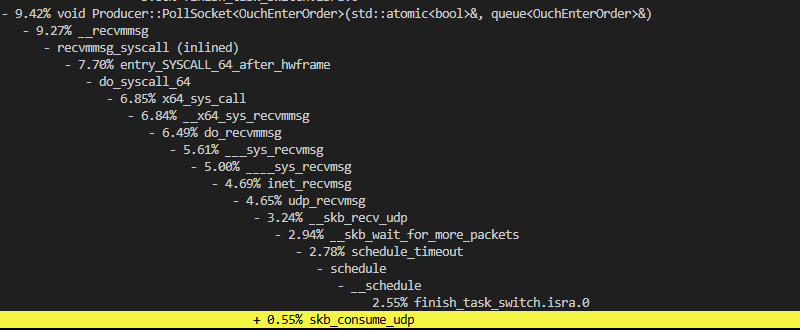

It looks like about 30% of this recvmmsg is in the context switching and syscall overhead, about 30% is in waiting for the next packet, and the remaining 30% is internal to the linux UDP network stack. What is really suprising to me about this is that online, its easy to hear about the millions of packets/sec that io_uring provides over syscalls, however, here we see really only a potential doubling improvement over using the normal blocked syscall because the context switching overhead is about equal to the amount of time it takes to process a UDP packet and give it to userspace on my machine. I'll ensure that the simulator is faster and once that bottleneck is cleared, it will be interesting to read if io_uring makes the actualy UDP packet processing and handoff from the socket into userspace more efficient rather than just eliminating the syscall overhead. At the end of the day, however, the processing it needs to do which takes ~30% seems like it may be similar. I'll read more and we will see!

As for the lack of packets coming in, I was suprised since when I ran an analysis of sent/recieved packets to see if that was the bottleneck, I got this chart:

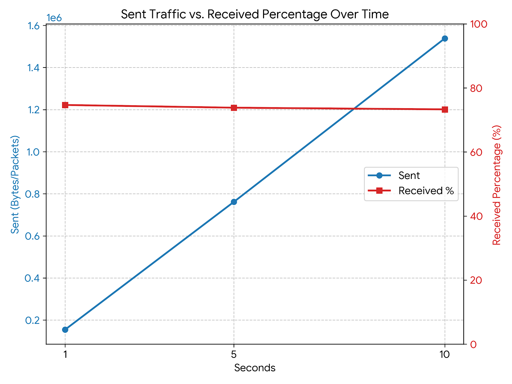

What we see here is that as we increase the time of the simulation, the total packets obviously rise linearly, but the amount of packets recieved divided by the amount sent, the recieve rate, is not near 1 and not constant! We would expect a near-1 rate if our SPSC was actually bound on the number of orders coming in, however, this is not what we see. One possible explaination is that the SPSC has a higher startup overhead and the simulator sends a bunch of packets before it can start recieving, artifically lowering the recieve rate, however, if we increase the time, we would expect the recieve rate to then converge to one, and instead it stays constant. we see an 80% accept rate across all time horizons, which points to loss on the socket queue acceptance end(i.e tons of deliveries at once, overloading the queue leading to packet rejection).

My first idea of fixing this is to ensure our recvmmsg thread never gets slept by the scheduler if it times out, which will hopefully cause it to poll the whole time and not let bursts come in without taking messages from the socket at a higher rate.

Wow... I ran lscpu and realized I only have 4 physical cores... setting the affinity correctly and disabling irqs on the three I use for SCPSC and the simulator, I literally double the output to 200k/s. Insane! It looks like all along the huge bottleneck there was literally the producer just being slept and then packets getting rejected by the kernel for a full socket queue! With a receive rate of about 1, we know that the actual bottleneck here is now in the the simulator rather than the producer. Lets perf the simulator!

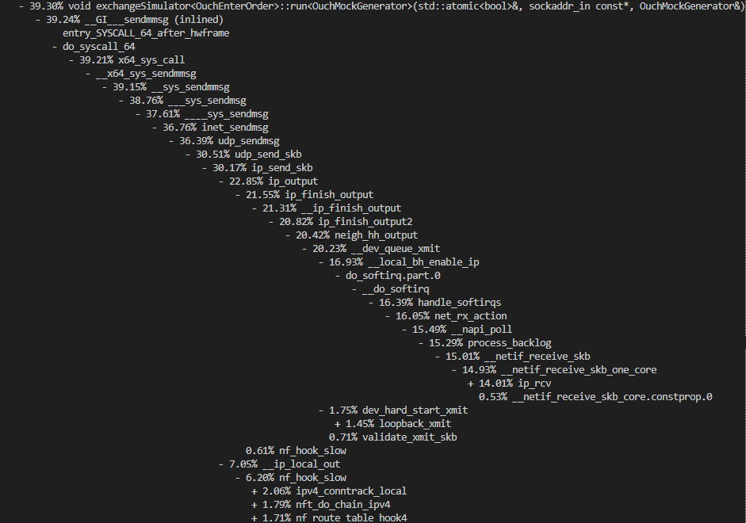

Okay, the context switching overhead is actually only 1/39 of the used cpu time. It looks like 7/39 is on nf hooks, which is a clear candidate to get rid of. That is far from a major breakthrough though or the context-switch bound situation that we people online talk about needing io_uring for. Looking further, 14/38 of the time is actually spent... recieveing?

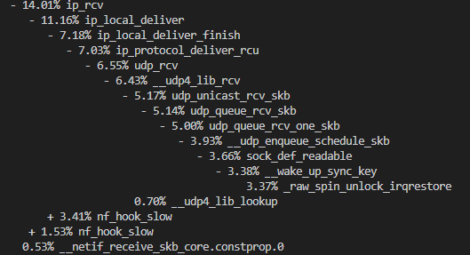

So, we receive with 14%/39% of our sender thread, which 7% of that 14% is nf_hooks again, meaning that we spend 14/39 on nf_hooks and we do 7% of the sender thread on actually putting our message within the socket for the recv thread. Of that 7%, we are actually spending half on a spinlock on the socket.

So, the obvious next step here to optimize our sender is turning off our network hooks(looks like our local deliver(NF_INET_LOCAL_IN) and outward send hoooks(NF_INET_LOCAL_OUT) are triggering) and then maybe getting the receive of the packet onto a different thread(ideally the systems core 0 rather than the producer/recv thread). Lets do that!

Well, also here we have to make a decision about how we want to think about this simulation. Because we are just sending packets between two applications, we could use eBPF to directly link them, however, I think that is contrary to waht I want to learn in optimizing this stack, instead, I would rather pretend(or actually steup) a network interface that passes these packets so there is room to optimize down there later as well. Because of that, I'm going to use veth(reccommended by Claude as a way to simulate this). This will do the pass over the data-link layer. All this entailed was creating two network namespaces and binding veth interfaces to each other within the namespaces as described in [this](https://superuser.com/questions/764986/howto-setup-a-veth-virtual-network). Because we have a virtual network interface(only bound between two veth interfaces inside two network namespaces) we load them individually in the sender and recieving threads, bind our sockets, and then we can use SO_BINDTODEVICE which will bypass our network hooks!

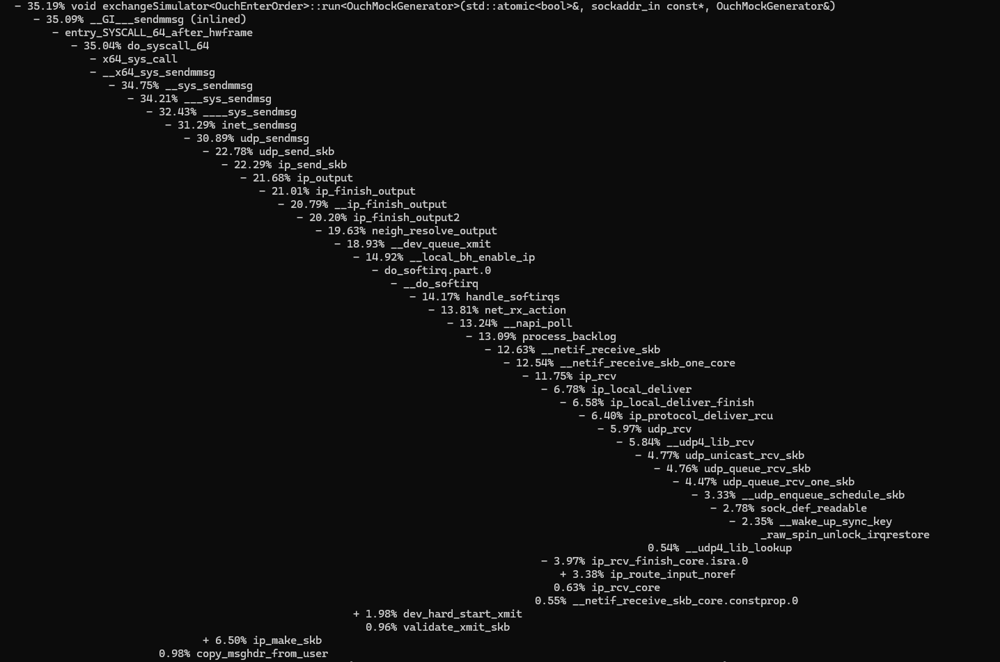

As you can see, our overhead from our network filtering hooks is gone now that we are on our private network namespaces! After this change, we get boosted to 360k/s with >99% packet reception rate on our producer. Despite this victory, we still see that 14%/35% of our sender is actually still doing the direct local_ip delivery and doing the ip_recv function itself within the softirq's. Really, we would like the irq's to get picked up by our allocated system cores rather than the ones we have running our sender. Our irq's are presumably being triggered by our tranmission queue since we see that queue_xmit function. Because this is not actually one process part of our send, we can set our irq affinity to 0 for that core to prevent this(and also all the other non-sys cores while we are at it).

Well, looking into irqbalance people seem to think there is a good reason not to shift soft irqs anywhere.

trying out non-blockign for our simulator somewhat unsprisingly changes neither the output nor even the perf graph. Because the sendmmsg stack is immediately putting a softirq onto this core and everything is tied to this core, the waking and sleeping overhead is actually the same since the nonblocking call still sleeps the sender until the message is written due to the softirq being scheduled ahead of it.

Interestingly enough, however, at this point we seem to be bound on our consumer! Our producer is actually never waiting for messages and is instead busy waiting for about 1/3 of its time on the consumer!! Below we have a perf to show this:

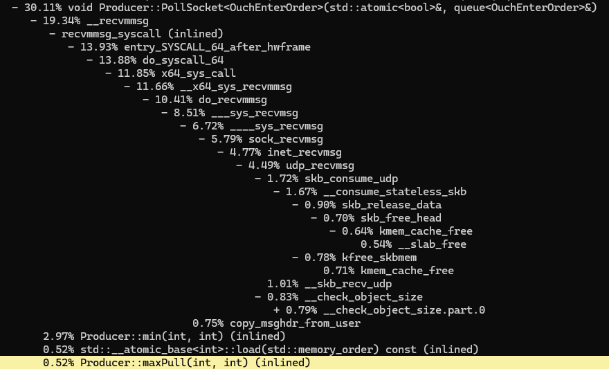

Because of this, I figure it is about time to optimize the orderbook logic itself. 

Image(I forgot to screeshot this one at the time but still wrote about it at then)

huh.. weird: 1/3 of the time of the consumer is waiting on the producer and 2/3 of the time of the consumer is waiting on the producer. What this likely means is our consumer has some really heavy peaks which halt the consumer and then lap around quickly, making the producer wait on the consumer 1/3 of the time(it should be 0% ideally). Roughly 20% of the consumer's time is spent in the consume function.

To prevent spiking, I re-structured the actual trade execution. Instead of storing all trades in an array of prices with a DLL of orders in each, I just am making a heap for buy and sell which allows for which comparisons at the top of each, making execution O(log n * k) where n is the size of the order book and k is the number of trades executed. This compares to the previous algortihm which was O(l) on l being the range of the spread of the orderbook, which could be up to 4096 operations of checking if std::list objects are empty. An important thing to also note is that our orderbook never gets all that large since our generation function is uniformly distributed around the spread.

The redesign is this: keep all the orders in memory in a token -> order hashmap. Then, we only need insert operations and pop to run our buy/sell heaps. We can just tombstone all of the cancel/replace operations within the hashmap in O(1). The great thing about this is we also get contiguous accesses on the std::Vector backing our heaps on small objects that fit in the cache(just a token + pointer duo). This setup puts in work and got us down to less than 5% of the consumer time! If we assume relatively evenly distributed compute across consumes, we could 20x our numbes with this current consumer! Below is a snapshot of the post-optimization perf:

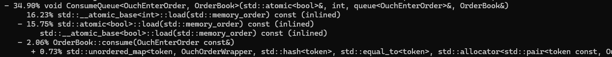

Huh... I think I misinterpreted our last perf. I assumed that since only half of the producer was spent in recvmmsg, it must be waiting on the consumer, however, now with the consumer only spending 2% of its time actually consuming and the rest of the time waiting, I realize that if the recvmmsg call immediately returns with only a couple messages often, it will look like we are spinning on the consumer because we are continually loading the atomic for how much we can add to the ring buffer. In reality, our bottleneck could actually be because of recvmmsg not getting much at a time. So, lets look at the simulator:

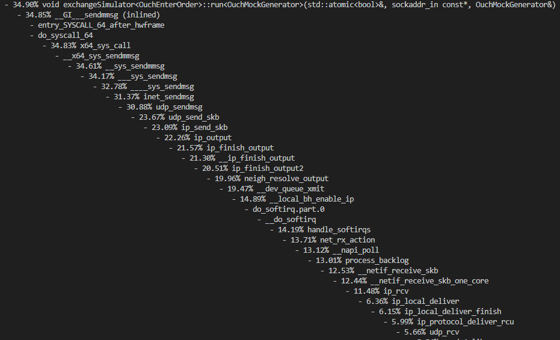

Well, it is just doing the send syscall the entire time. Looks like our bottleneck is wholly just this sendmmsg. We've already stopped the nethooks and this is just doing the direct to the xmit transmission queue and back.

At this point, I should note that I am switching over to a different reference machine with 8 physical cores which will allow pinning differently. With the machine switch we get to 370k/s. That machine is running a 8840HS Ryzen 7 processor with 16GB of RAM on Linux Kernel 7.0.

## 2. IO_URING

After some experimentation here(Which resulted in code for a UringExchange executable which was marginally slower than the Syscall one), I found io_uring to likely NOT be the solution to this problem. Instead, it introduced more overhead through dealing with the queue entries(since even multishot requires a whole lot of that). Since our blocking in recvmmsg is likely not really the context switch since so much of the overhead is amortized, it is probably worth investigating some sort of SoftIRQ balancing to allow for more recvmmsg and sendmmsg calls to actually happen.

## Past Naivety

So, since the IO_Uring really did not work in terms of throughput and overhead(I'm sure it might be better on latency, but I am not building for latency here due to that being a bite trite/played out). The question then is how I can use the rest of the cores on my machine to handle softIRQs in a way that makes sense(currently being handled by one CPU which is the same one that delivers the udp packets to the mit_queue makes absolutely zero sense becasue basically everything is on that one core).

https://docs.kernel.org/networking/scaling.html gives us a way to balance the recv udp softIRQs triggered by the hardIRQ from sending a packet to a veth to the non-pinned cores. This allows us to use all of our physical cores to do the network stack work. To do this, I just pinned our SPSC and simulator cores to seperate physical cores:

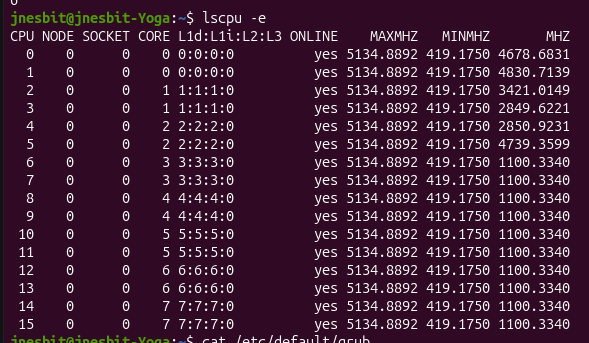

consumerCore = 11;// physical core 5
senderCore = 13; // phyiscal core 6
producerCore = 15; // physical core 7
The rest of the cores we set for RPS: cores 0,1,2,3,4 which is 0 through logical core 9 using:

'''sudo ip netns exec receiver_ns sh -c 'echo 3ff > /sys/class/net/veth-rx/queues/rx-0/rps_cpus' '''

and 

'''GRUB_CMDLINE_LINUX_DEFAULT="isolcpus=10-15 rcu_nocbs=10-15 nohz_full=10-15 irqaffinity=0-9"'''
in /etc/default/grub

This gets us to ~480k/s on the SPSC and about 530k/s on the sender!! That is a massive improvement, and shows that we now are bound on the SPSC presumably :)

Now, lets see where thet bottleneck is now?

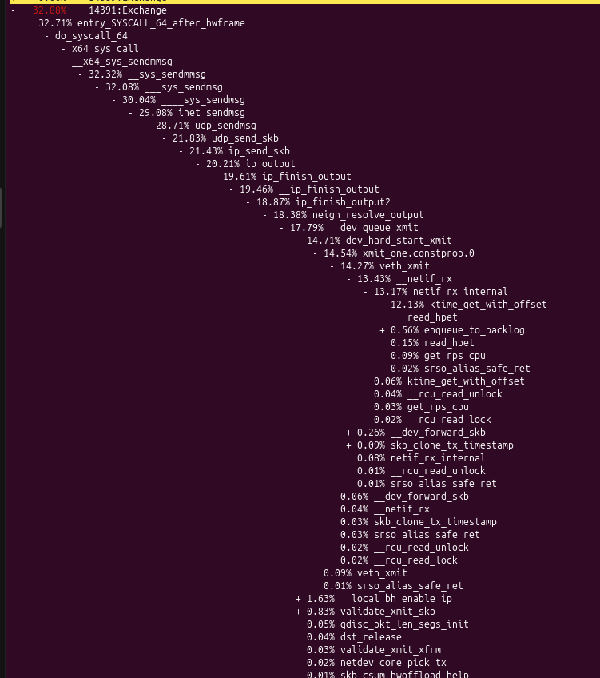

Huh... the high-precision clock is our bottleneck? A google shows a potential reason: https://news.ycombinator.com/item?id=28661455. Well, actually this makes sense since I am on a laptop and obviously TSC could be a problem due to battery being inconsistent, sleeping, etc.

Because of this, I am actually going to start running benchmarks on a rented bare-metal from Vultr, a dedicated  E-2286G (6 cores, 32GB RAM).

Switching over, isolating our three cores for our busy-waits and balancing softIRQs on the other three, we get 730k/s messages. That is an improvement(to be expected) so lets look at what the bottleneck is at this point:

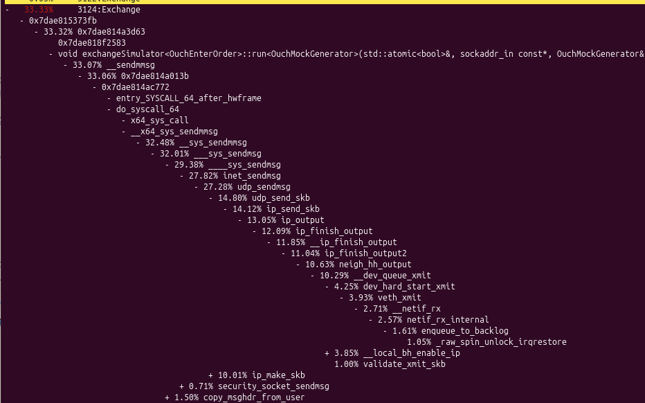

and for our producer(consumer shows entire time basically busy-waiting):

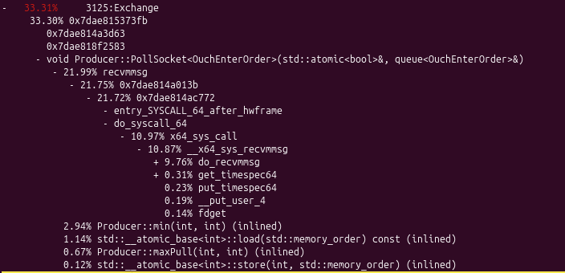

Well, it seems clear what is happening here: only 10% of our producer is actually spent fetching for recvmmsg, it looks like the rest of the time it is basically busy-polling the socket and recvmmsg returns nothing(hence how the top syscall has a lot more percentage than the lower, it is just returning because the socket is empty seemingly). Similarly, we see a 2% spend on the function calculating the number of messages we can take it(which is only a couple instructions and no loads that wouldn't be cached presumably) so that really only can happen if we are polling a LOT and the rest of that ends up in the top of the recvmmsg syscall seemingly. Looking at the sender, we seemingly have maxed-out how many UDP packets we can actually send from one core. It is spending nearly 100% of the time in the core within the actual network stack! And all the recvmmsg softIRQs are offloaded too on this!

So, lets bump it up? Why not grab another sender core to simulate even more messages and just see when the cracks start to show?

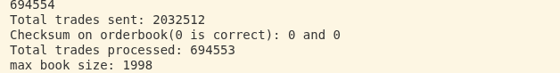

Wow, okay, doubling up on our senders gets us to 2 Million/sec, but our producer isn't actually seeing that in its queue? It still looks like it is exiting early the majority of the time. My suspicion is actually that this might be due to the batch sizes on these calls being too large so when the skb is full they deliver partials*or get rejected and take resources) and then we have to wait for the next softIRQ, causing lags on the producer. Sendmmsg actually doesnt error when the skb is full(obviously because recvmmsg puts into the skb).

## 4. AI Usage

I will not be using any AI-generated code for this project other than where explicitly stated. Currently the only use was generating some of the OUCH generation code which I found tedious.